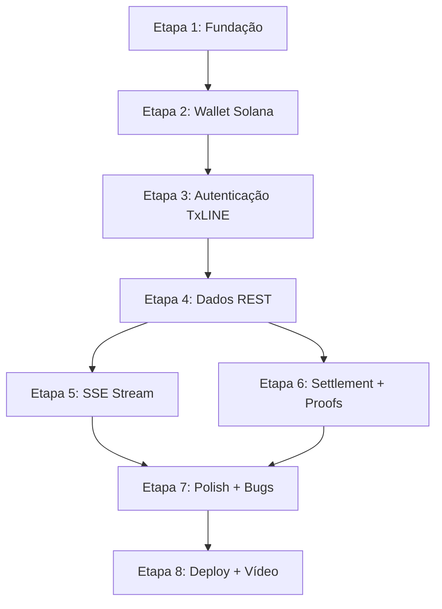

# ProofLens — Plano de Implementação Revisado

> Baseado na auditoria técnica + documentação oficial TxLINE + regras do hackathon

---

## Análise Crítica do Plano Original

O plano em [02_IMPLEMENTATION_PLAN.md](file:///c:/Users/Leo/Downloads/prooflens-prediction-market-d9a37/.ai/02_IMPLEMENTATION_PLAN.md) tem a **estrutura correta** mas apresenta 3 problemas para a realidade atual:

| Problema | Impacto |
|---|---|
| **12 fases é demais** para ~20 horas. Fases 1 e 2 (infra + types) podem ser uma só. Fases 6, 7 e 8 (settlement + explainable + receipt) podem ser uma só. | Perda de tempo com separação artificial |
| **Ignora requisitos obrigatórios de submissão**: deploy e vídeo demo não aparecem como etapas com peso real | Risco de desclassificação |
| **Autenticação TxLINE é mais complexa do que o previsto**: requer transação on-chain (`subscribe`) + assinatura de wallet + ativação — dependências pesadas de Solana libs | Pode consumir metade do tempo |

### O que está certo no plano original
- Ordem de prioridades (infraestrutura → integração → settlement → polish)
- Filosofia incremental (cada etapa compila)
- Princípio de não quebrar o que já funciona

---

## Fluxo de Autenticação TxLINE (da documentação oficial)

> [!IMPORTANT]
> O fluxo abaixo é **obrigatório** para consumir qualquer dado da API. Sem ele, nenhuma integração funciona.

```
1. Conectar wallet Solana (Phantom/Solflare)
2. POST /auth/guest/start → Guest JWT
3. Transação on-chain: program.methods.subscribe(SERVICE_LEVEL, DURATION)
4. Assinar mensagem: `${txSig}::${jwt}` com wallet
5. POST /api/token/activate → API Token
6. Usar headers: Authorization: Bearer ${jwt} + X-Api-Token: ${apiToken}
```

**Dependências npm necessárias**: `@coral-xyz/anchor`, `@solana/web3.js`, `@solana/spl-token`, `@solana/wallet-adapter-react`, `@solana/wallet-adapter-phantom`, `tweetnacl`

**Network para hackathon**: Devnet (Service Level 1, gratuito, real-time)

---

## Plano Revisado: 8 Etapas

### Mapa de Dependências



---

### Etapa 1 — Fundação (Types + API Client + Env)

**Objetivo**: Criar toda a infraestrutura de tipos e o cliente HTTP centralizado. Nenhuma funcionalidade muda, mas a base para tudo está pronta.

**Arquivos criados**:
- `src/types/txline.ts` — Todas as interfaces TypeScript (Match, Fixture, Odds, Score, Settlement, Proof, etc.) baseadas no schema JSON da TxLINE
- `src/services/txline/config.ts` — Configuração de rede (devnet/mainnet), URLs, program IDs
- `src/services/txline/apiClient.ts` — Wrapper fetch com headers de auth, tratamento de erros, retry
- `.env` — `VITE_TXLINE_NETWORK`, `VITE_SOLANA_RPC_URL`

**Arquivos modificados**: Nenhum

**Risco**: 🟢 Baixo — não toca em nada existente

**Dependências**: Nenhuma

**Tempo estimado**: ~1 hora

---

### Etapa 2 — Wallet Solana Real

**Objetivo**: Substituir a wallet fake do store por integração real com Solana Wallet Adapter (Phantom). O botão "Connect Wallet" do Header passa a abrir o Phantom e conectar de verdade.

**Arquivos criados**:
- `src/services/txline/wallet.tsx` — WalletProvider setup (WalletAdapterNetwork, ConnectionProvider)

**Arquivos modificados**:
- `src/stores/main.ts` — Expandir state com: `publicKey`, `connected`, `signMessage`, `signTransaction`
- `src/App.tsx` — Wrapping com `WalletProvider` e `ConnectionProvider`
- `src/components/Header.tsx` — Usar `useWallet()` do Solana adapter em vez de store fake
- `src/components/Sidebar.tsx` — Mostrar endereço real (base58) e balanço SOL real
- `src/components/MobileNav.tsx` — Atualizar botão wallet

**Risco**: 🟡 Médio — dependência de novas libs (`@solana/wallet-adapter-*`), possível conflito com React 19

**Dependências**: Etapa 1 (config com network/RPC)

**Tempo estimado**: ~2 horas

---

### Etapa 3 — Autenticação TxLINE

**Objetivo**: Implementar o fluxo completo: Guest JWT → Subscribe on-chain → Activate → API Token. Após esta etapa, a app tem credenciais válidas para chamar a API.

**Arquivos criados**:
- `src/services/txline/auth.ts` — `getGuestJwt()`, `subscribeOnChain()`, `activateToken()`, `getAuthHeaders()`

**Arquivos modificados**:
- `src/stores/main.ts` — Adicionar: `guestJwt`, `apiToken`, `authStatus: 'idle' | 'subscribing' | 'activating' | 'ready' | 'error'`, `authError`
- `src/components/Header.tsx` — Mostrar status da autenticação (conectado vs autenticado na TxLINE)

**Risco**: 🔴 Alto — Este é o passo mais complexo. A transação on-chain pode falhar (SOL insuficiente, RPC instável). A assinatura da mensagem precisa ser exata. Incompatibilidade de rede pode bloquear tudo.

**Dependências**: Etapa 2 (wallet real conectada)

**Tempo estimado**: ~3 horas

> [!WARNING]
> Esta é a etapa com maior risco de bloqueio. Sugiro testar a autenticação isoladamente antes de integrar com a UI. Se bloquear, considerar usar um token pré-ativado via script de CLI separado.

---

### Etapa 4 — Dados REST (Substituir Mocks)

**Objetivo**: Substituir todos os dados hardcoded do `useTxLine()` por dados reais da API. O Dashboard, Matches, Markets e MatchDetails passam a mostrar dados da Copa do Mundo real.

**Arquivos criados**:
- `src/services/txline/fixtures.ts` — `getFixtures()`, `getFixtureById()`
- `src/services/txline/odds.ts` — `getOddsSnapshot()`
- `src/services/txline/scores.ts` — `getScoresSnapshot()`

**Arquivos modificados**:
- `src/hooks/use-tx-line.ts` — **Reescrita completa**: substituir objetos literais por `fetch` + `useEffect` + `useState`. Adicionar estados: `loading`, `error`, `data`. Retornar dados no mesmo formato que os componentes esperam (adapter pattern).
- `src/components/dashboard/StatsRow.tsx` — Derivar stats dos dados reais ou manter calculados
- `src/components/dashboard/LiveMatch.tsx` — Tratar loading/error states
- `src/components/dashboard/FeaturedMarkets.tsx` — Tratar loading/error, corrigir `titleKey` → `title`
- `src/components/dashboard/UpcomingMatches.tsx` — Tratar loading/error
- `src/components/dashboard/RecentSettlements.tsx` — Corrigir `timeAgo`/`minutesAgo` inconsistency
- `src/pages/MatchDetails.tsx` — Usar parâmetro `:id` de verdade para buscar partida específica

**Risco**: 🟡 Médio — Depende do formato real dos dados da TxLINE. O adapter pattern no hook mitiga isso: se o formato mudar, apenas o hook precisa de ajuste.

**Dependências**: Etapa 3 (API Token válido)

**Tempo estimado**: ~3 horas

---

### Etapa 5 — SSE Stream (Tempo Real)

**Objetivo**: Conectar ao stream SSE da TxLINE para receber atualizações em tempo real (odds, scores, eventos). A interface atualiza automaticamente sem refresh.

**Arquivos criados**:
- `src/services/txline/stream.ts` — `connectOddsStream()`, `connectScoresStream()`, parsing de eventos SSE, reconexão automática

**Arquivos modificados**:
- `src/hooks/use-tx-line.ts` — Adicionar efeito que conecta ao SSE e atualiza os dados em tempo real
- `src/stores/main.ts` — Opcional: armazenar eventos de stream no estado global se necessário para múltiplos componentes
- `src/components/Header.tsx` — Status pills refletem conexão real do SSE

**Risco**: 🟡 Médio — SSE depende de auth funcional. O formato dos eventos precisa ser mapeado. Reconexão e cleanup do EventSource precisam ser robustos.

**Dependências**: Etapa 4 (dados REST funcionando, hook reescrito)

**Tempo estimado**: ~2 horas

---

### Etapa 6 — Settlement + Proofs + Explainable

**Objetivo**: Implementar o **diferencial do projeto**: buscar proofs de validação da TxLINE, exibir Merkle Proofs reais, e gerar a explicação em linguagem natural. O VerificationStepper mostra dados reais. O recibo é verificável.

**Arquivos criados**:
- `src/services/txline/validation.ts` — `getFixtureProof()`, `getScoreProof()`, `getOddsProof()`
- `src/services/txline/explainable.ts` — Função que transforma hash + signature + proof + timestamp em texto amigável em português/inglês

**Arquivos modificados**:
- `src/components/VerificationStepper.tsx` — Aceitar props dinâmicas (steps reais com timestamps reais) em vez de dados hardcoded
- `src/pages/SettlementEngine.tsx` — Substituir tx hash, merkle root e signature mockados por dados reais da TxLINE. Integrar o fluxo: receber evento → buscar proof → validar → exibir recibo.
- `src/components/dashboard/ReplaySection.tsx` — Conectar ao settlement real mais recente

**Risco**: 🟡 Médio — Depende de ter partidas finalizadas para haver dados de settlement. Se não houver partidas encerradas no momento, podemos usar dados históricos da API.

**Dependências**: Etapa 4 (dados REST), parcialmente Etapa 5 (para settlement em tempo real)

**Tempo estimado**: ~3 horas

---

### Etapa 7 — Polish + Correção de Bugs

**Objetivo**: Corrigir inconsistências identificadas na auditoria, melhorar loading states, tratar edge cases.

**Bugs a corrigir**:
- `MatchDetails` ignorando parâmetro `:id` (se não resolvido na Etapa 4)
- `market.title` vs `market.titleKey` mismatch
- `settlement.timeAgo` vs `settlement.minutesAgo`
- Endereço wallet formato Ethereum → Solana base58
- `useMarketLabel` não utilizado → integrar nos componentes

**Melhorias**:
- Loading skeletons em todos os componentes que buscam dados
- Error states amigáveis
- Empty states adequados
- Responsividade mobile
- Verificar que i18n funciona com dados reais

**Arquivos modificados**: Diversos (correções pontuais)

**Risco**: 🟢 Baixo — correções isoladas

**Dependências**: Etapas 4-6 concluídas

**Tempo estimado**: ~2 horas

---

### Etapa 8 — Deploy + Vídeo Demo

**Objetivo**: Fazer deploy em produção e gravar o vídeo de demonstração (obrigatório para submissão).

**Deploy**:
- Build com `npm run build`
- Deploy em Vercel/Netlify (SPA com redirect para index.html)
- Configurar variáveis de ambiente no hosting
- Testar em URL pública

**Vídeo Demo (até 5 min)**:
- Roteiro baseado nos critérios de avaliação:
  1. Problema (transparência na liquidação)
  2. Solução (ProofLens)
  3. Walkthrough da app ao vivo
  4. Mostrar dados reais da TxLINE
  5. Mostrar atualização em tempo real (SSE)
  6. Mostrar liquidação verificável + Merkle Proof
  7. Mostrar Explainable Settlement
  8. Mostrar recibo verificável
  9. Falar sobre arquitetura e TxLINE endpoints usados

**Submissão**:
- Preencher formulário Superteam Earn
- Link do MVP
- Link do repo público
- Link do vídeo
- Documentação técnica breve
- Feedback sobre a API

**Risco**: 🟡 Médio — Deploy pode ter problemas de env vars ou CORS

**Dependências**: Todas as etapas anteriores

**Tempo estimado**: ~2 horas

---

## Resumo de Tempo

| Etapa | Tempo | Acumulado |
|---|---|---|
| 1. Fundação | ~1h | 1h |
| 2. Wallet Solana | ~2h | 3h |
| 3. Autenticação TxLINE | ~3h | 6h |
| 4. Dados REST | ~3h | 9h |
| 5. SSE Stream | ~2h | 11h |
| 6. Settlement + Proofs | ~3h | 14h |
| 7. Polish + Bugs | ~2h | 16h |
| 8. Deploy + Vídeo | ~2h | 18h |
| **Total** | **~18h** | — |

> [!CAUTION]
> Margem de **~2 horas** para imprevistos. Se a autenticação bloquear, considerar as alternativas abaixo.

---

## Estratégia de MVP Mínimo (Plano B)

Se o tempo ficar muito curto ou a autenticação bloquear:

**MVP mínimo para submissão** (em ordem de prioridade):
1. Etapa 1 (tipos + apiClient) ← sempre necessário
2. Pular Etapas 2-3 — usar um **token pré-ativado via script CLI** e hardcodá-lo como env var
3. Etapa 4 (dados REST com token fixo)
4. Etapa 6 parcial (settlement com dados históricos)
5. Etapa 8 (deploy + vídeo)

Isso dá um MVP funcional com dados reais em ~8 horas.

---

## Questões para você

1. **Vocês já têm uma wallet Solana com SOL na devnet?** Se não, precisamos fazer airdrop antes de tudo.
2. **Vocês já fizeram o subscribe + activate em algum momento?** Se sim, já temos um API Token e podemos pular a Etapa 3.
3. **O deploy será em qual plataforma?** (Vercel, Netlify, outro?)
4. **Quem vai gravar o vídeo demo?** Precisa ser priorizado logo cedo.
