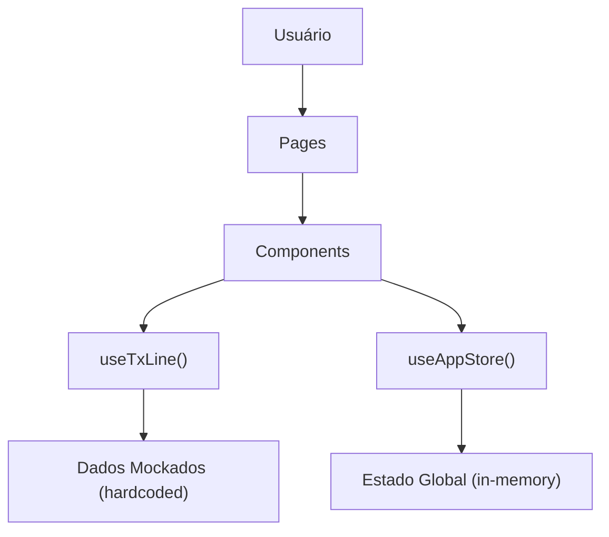
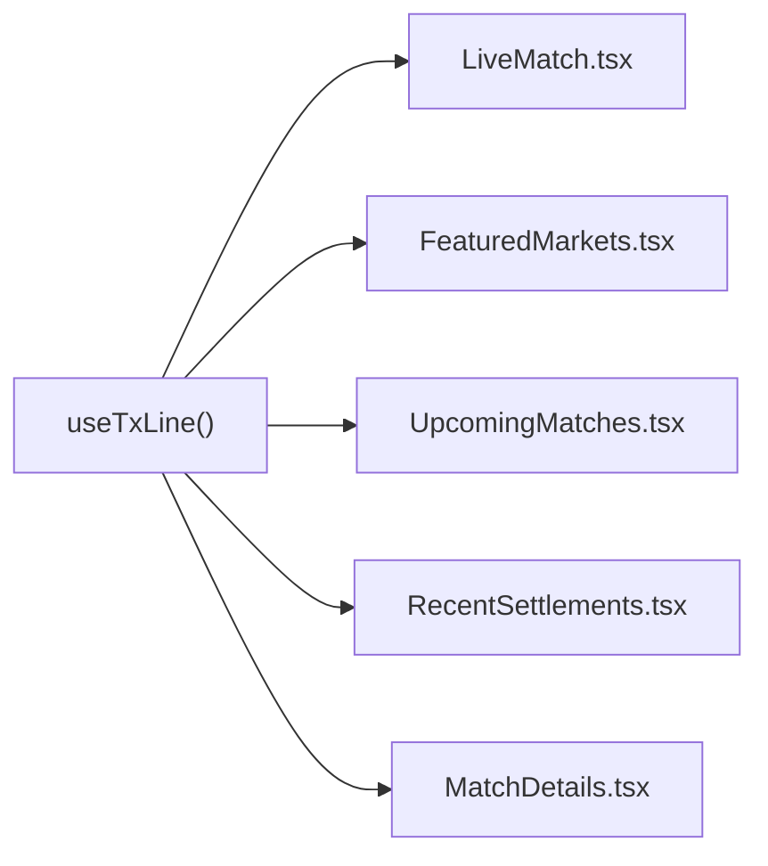
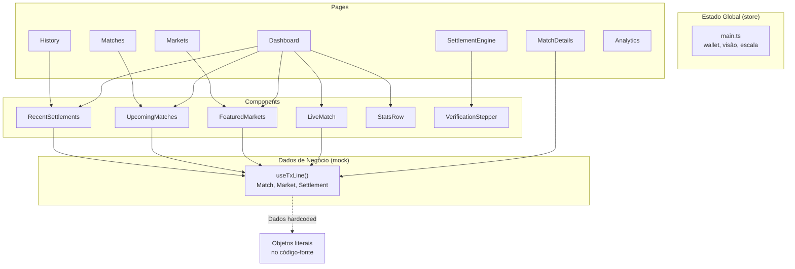

# ProofLens — Relatório Técnico Completo (Phase 0 Audit)

> Auditoria realizada em 18/07/2026 — Nenhum código foi alterado.

---

## 1. Visão Geral da Arquitetura

O projeto é uma SPA (Single Page Application) construída com:

| Tecnologia | Versão | Função |
|---|---|---|
| React | 19.2.7 | UI Library |
| Vite | 8.0.16 | Build Tool |
| TypeScript | 6.0.3 | Tipagem |
| Tailwind CSS | 3.4.19 | Estilização |
| Shadcn/UI (Radix) | Diversas | Componentes base |
| React Router DOM | 7.18.0 | Roteamento |
| Recharts | 3.8.1 | Gráficos |
| Lucide React | 0.577.0 | Ícones |
| Zod | 4.4.3 | Validação (não utilizado) |

### Fluxo atual da arquitetura



> [!WARNING]
> A arquitetura atual **NÃO possui** camada de services, types centralizados, nem integração real com API. Todo dado vem de objetos hardcoded dentro do hook `useTxLine()`.

---

## 2. Mapa de Rotas

Definidas em [App.tsx](file:///c:/Users/Leo/Downloads/prooflens-prediction-market-d9a37/src/App.tsx):

| Rota | Componente | Layout | Descrição |
|---|---|---|---|
| `/welcome` | `Landing` | Sem layout | Página de boas-vindas |
| `/` | `Dashboard` | Com Sidebar + Header | Dashboard principal |
| `/markets` | `Markets` | Com layout | Listagem de mercados |
| `/matches` | `Matches` | Com layout | Listagem de partidas |
| `/match/:id` | `MatchDetails` | Com layout | Detalhes de uma partida |
| `/settlement` | `SettlementEngine` | Com layout | Motor de liquidação |
| `/verification` | `SettlementEngine` | Com layout | Mesma página do settlement |
| `/history` | `History` | Com layout | Histórico de liquidações |
| `/analytics` | `Analytics` | Com layout | Dashboard de analytics |
| `/accessibility` | `Accessibility` | Com layout | Centro de acessibilidade |
| `/alerts` | `Alerts` | Com layout | Alertas (vazio) |
| `/settings` | `Settings` | Com layout | Configurações da conta |
| `*` | `NotFound` | Sem layout | Página 404 |

> [!NOTE]
> A rota `/verification` aponta para o mesmo componente `SettlementEngine` que `/settlement`.

---

## 3. Inventário Completo de Componentes

### 3.1 Componentes de Layout

| Componente | Arquivo | Função |
|---|---|---|
| Layout | [Layout.tsx](file:///c:/Users/Leo/Downloads/prooflens-prediction-market-d9a37/src/components/Layout.tsx) | Shell principal: Sidebar + Header + Outlet + MobileNav |
| Header | [Header.tsx](file:///c:/Users/Leo/Downloads/prooflens-prediction-market-d9a37/src/components/Header.tsx) | Barra superior: status pills, busca, seletor de idioma, wallet |
| Sidebar | [Sidebar.tsx](file:///c:/Users/Leo/Downloads/prooflens-prediction-market-d9a37/src/components/Sidebar.tsx) | Navegação lateral (desktop) com 10 itens |
| MobileNav | [MobileNav.tsx](file:///c:/Users/Leo/Downloads/prooflens-prediction-market-d9a37/src/components/MobileNav.tsx) | Barra de navegação inferior (mobile) com 4 itens + wallet |

### 3.2 Componentes de Funcionalidade

| Componente | Arquivo | Fonte de dados | Função |
|---|---|---|---|
| VerificationStepper | [VerificationStepper.tsx](file:///c:/Users/Leo/Downloads/prooflens-prediction-market-d9a37/src/components/VerificationStepper.tsx) | **Hardcoded** (6 steps) | Stepper visual do processo de verificação |
| LanguageSelector | [LanguageSelector.tsx](file:///c:/Users/Leo/Downloads/prooflens-prediction-market-d9a37/src/components/LanguageSelector.tsx) | i18n context | Dropdown/Sheet de seleção de idioma |
| LanguageBanner | [LanguageBanner.tsx](file:///c:/Users/Leo/Downloads/prooflens-prediction-market-d9a37/src/components/LanguageBanner.tsx) | i18n context | Banner de detecção automática de idioma |

### 3.3 Componentes de Dashboard

| Componente | Arquivo | Fonte de dados | O que renderiza |
|---|---|---|---|
| LiveMatch | [LiveMatch.tsx](file:///c:/Users/Leo/Downloads/prooflens-prediction-market-d9a37/src/components/dashboard/LiveMatch.tsx) | `useTxLine().liveMatch` | Card da partida ao vivo (placar, time, bandeiras) |
| FeaturedMarkets | [FeaturedMarkets.tsx](file:///c:/Users/Leo/Downloads/prooflens-prediction-market-d9a37/src/components/dashboard/FeaturedMarkets.tsx) | `useTxLine().featuredMarkets` | Grid 4 colunas com mercados, odds e probabilidades |
| UpcomingMatches | [UpcomingMatches.tsx](file:///c:/Users/Leo/Downloads/prooflens-prediction-market-d9a37/src/components/dashboard/UpcomingMatches.tsx) | `useTxLine().upcomingMatches` | Lista de próximos jogos |
| RecentSettlements | [RecentSettlements.tsx](file:///c:/Users/Leo/Downloads/prooflens-prediction-market-d9a37/src/components/dashboard/RecentSettlements.tsx) | `useTxLine().recentSettlements` | Lista de liquidações recentes |
| StatsRow | [StatsRow.tsx](file:///c:/Users/Leo/Downloads/prooflens-prediction-market-d9a37/src/components/dashboard/StatsRow.tsx) | **Hardcoded inline** | 5 cards de estatísticas com sparklines |
| ReplaySection | [ReplaySection.tsx](file:///c:/Users/Leo/Downloads/prooflens-prediction-market-d9a37/src/components/dashboard/ReplaySection.tsx) | Nenhuma (usa VerificationStepper) | Replay visual da liquidação mais recente |

### 3.4 Componentes Shadcn/UI (50 arquivos)

Diretório: [src/components/ui/](file:///c:/Users/Leo/Downloads/prooflens-prediction-market-d9a37/src/components/ui)

Incluem: accordion, alert-dialog, alert, avatar, badge, breadcrumb, button, calendar, card, carousel, chart, checkbox, collapsible, command, context-menu, dialog, drawer, dropdown-menu, form, hover-card, input-otp, input, label, menubar, navigation-menu, pagination, popover, progress, radio-group, resizable, scroll-area, select, separator, sheet, sidebar, skeleton, slider, sonner, switch, table, tabs, textarea, toast, toaster, toggle-group, toggle, tooltip, use-toast.

> [!TIP]
> Estes são componentes base do Shadcn/UI e **NÃO devem ser modificados**.

---

## 4. Mapa de Dados Mockados (PONTO CRÍTICO)

### 4.1 O Hub Central: [use-tx-line.ts](file:///c:/Users/Leo/Downloads/prooflens-prediction-market-d9a37/src/hooks/use-tx-line.ts)

**Este é o único arquivo que fornece dados de negócio para toda a aplicação.** Tudo é hardcoded:

```
useTxLine() retorna:
├── liveMatch          → 1 objeto Match hardcoded (Brazil 2-1 Japan)
├── upcomingMatches    → Array de 2 Match hardcoded (France vs Argentina, Germany vs Spain)
├── featuredMarkets    → Array de 4 Market hardcoded (Winner, Over/Under, First Goal, Corners)
└── recentSettlements  → Array de 3 Settlement hardcoded (com payout mockado)
```

**Tipos definidos inline** (não em pasta `types/`):
- `Match` — id, homeTeam, awayTeam, homeFlag, awayFlag, score, time, isLive
- `Market` — id, matchId, titleKey, options[{label, odds, probability}], volume, isLive
- `Settlement` — id, matchName, marketName, marketType, status, payout, minutesAgo

### 4.2 Outros dados hardcoded

| Local | Dados |
|---|---|
| [StatsRow.tsx](file:///c:/Users/Leo/Downloads/prooflens-prediction-market-d9a37/src/components/dashboard/StatsRow.tsx#L22-L58) | 5 stats (Volume Total, Mercados Ativos, Liquidações, Tempo Médio, Taxa de Sucesso) |
| [VerificationStepper.tsx](file:///c:/Users/Leo/Downloads/prooflens-prediction-market-d9a37/src/components/VerificationStepper.tsx#L4-L11) | 6 steps do stepper com tempos fixos "89:56" |
| [Analytics.tsx](file:///c:/Users/Leo/Downloads/prooflens-prediction-market-d9a37/src/pages/Analytics.tsx#L4-L12) | 7 pontos de dados do gráfico (Mon-Sun) |
| [SettlementEngine.tsx](file:///c:/Users/Leo/Downloads/prooflens-prediction-market-d9a37/src/pages/SettlementEngine.tsx#L43) | Tx hash, Merkle Root, Signature payload (todos fictícios) |
| [Sidebar.tsx](file:///c:/Users/Leo/Downloads/prooflens-prediction-market-d9a37/src/components/Sidebar.tsx#L81-L86) | Balanço mockado (USDC: 1,250.50, SOL: 4.32) |
| [Header.tsx](file:///c:/Users/Leo/Downloads/prooflens-prediction-market-d9a37/src/components/Header.tsx#L8-L14) | Status pills (TxLINE API, Solana, Settlement Engine — todos estáticos "online") |
| [main.ts](file:///c:/Users/Leo/Downloads/prooflens-prediction-market-d9a37/src/stores/main.ts#L36) (store) | Endereço mockado da wallet: `0x7a3F...e82B` |

### 4.3 Quem consome `useTxLine()`



| Componente | Dado consumido |
|---|---|
| LiveMatch | `liveMatch` |
| FeaturedMarkets | `featuredMarkets` |
| UpcomingMatches | `upcomingMatches` |
| RecentSettlements | `recentSettlements` |
| MatchDetails | `liveMatch` + `featuredMarkets` |

---

## 5. Hooks

| Hook | Arquivo | Função | Estado |
|---|---|---|---|
| `useTxLine` | [use-tx-line.ts](file:///c:/Users/Leo/Downloads/prooflens-prediction-market-d9a37/src/hooks/use-tx-line.ts) | Fornece **todos** os dados mockados de negócio | 🔴 Precisa ser reescrito |
| `useAppStore` | [main.ts](file:///c:/Users/Leo/Downloads/prooflens-prediction-market-d9a37/src/stores/main.ts) | Estado global (wallet, visão, escala) | 🟡 Precisa expandir (auth) |
| `useIsMobile` | [use-mobile.tsx](file:///c:/Users/Leo/Downloads/prooflens-prediction-market-d9a37/src/hooks/use-mobile.tsx) | Detecta breakpoint mobile (768px) | ✅ OK |
| `useToast` | [use-toast.ts](file:///c:/Users/Leo/Downloads/prooflens-prediction-market-d9a37/src/hooks/use-toast.ts) | Sistema de toasts (Shadcn) | ✅ OK |
| `useI18n` | [context.tsx](file:///c:/Users/Leo/Downloads/prooflens-prediction-market-d9a37/src/i18n/context.tsx) | Internacionalização | ✅ OK |
| `useMarketLabel` | [market-labels.ts](file:///c:/Users/Leo/Downloads/prooflens-prediction-market-d9a37/src/lib/market-labels.ts) | Traduz labels de mercado (over/under/draw) | ✅ OK (mas não está sendo usado) |

---

## 6. Store

Existe **uma única store**: [src/stores/main.ts](file:///c:/Users/Leo/Downloads/prooflens-prediction-market-d9a37/src/stores/main.ts)

Implementada como um **state manager manual** (sem Zustand/Redux), usando `Set<listener>` pattern:

```typescript
Estado:
├── walletConnected: boolean        // false (mock)
├── walletAddress: string | null    // null → "0x7a3F...e82B" (mock)
├── visionMode: 'default' | 'protanopia' | 'deuteranopia' | 'tritanopia'
└── uiScale: number                 // 1 (default)

Ações:
├── connectWallet()    → seta address mockado
├── disconnectWallet() → reseta
├── setVisionMode()    → altera modo de visão
└── setUiScale()       → altera escala da UI
```

> [!IMPORTANT]
> A wallet connection é **completamente fake**. `connectWallet()` apenas seta uma string hardcoded. Não existe integração com Solana Wallet Adapter ou qualquer carteira real.

---

## 7. Internacionalização (i18n)

O sistema está completo com 11 idiomas:

- en, pt-BR, es, fr, de, it, pt-PT, ja, ko, zh, ar
- Detecção automática do idioma do navegador
- LanguageBanner para sugestão de troca
- RTL suportado (Arabic)

Diretório: [src/i18n/](file:///c:/Users/Leo/Downloads/prooflens-prediction-market-d9a37/src/i18n)

> [!NOTE]
> O sistema de i18n está funcional e não precisa de alteração para a integração com TxLINE.

---

## 8. Fluxo de Dados Atual



### Problema central

**Não existe camada de services.** O hook `useTxLine()` retorna objetos JavaScript literais. Não há:
- `fetch()` / `axios`
- `EventSource` (SSE)
- Estado de loading/error
- Cache
- Autenticação

---

## 9. O que Precisa Existir (e NÃO Existe)

### 9.1 Pastas que precisam ser criadas

```
src/
├── services/
│   └── txline/
│       ├── apiClient.ts      ← Cliente HTTP centralizado
│       ├── auth.ts           ← Autenticação (wallet → JWT → API Token)
│       ├── fixtures.ts       ← GET fixtures (partidas)
│       ├── scores.ts         ← GET scores (placares)
│       ├── odds.ts           ← GET odds (mercados)
│       ├── stream.ts         ← EventSource SSE
│       ├── validation.ts     ← validate_stat
│       └── proofs.ts         ← Merkle Proofs
│
└── types/
    ├── match.ts
    ├── team.ts
    ├── fixture.ts
    ├── score.ts
    ├── market.ts
    ├── odds.ts
    ├── settlement.ts
    ├── validation.ts
    ├── proof.ts
    ├── wallet.ts
    ├── receipt.ts
    ├── stream.ts
    └── auth.ts
```

### 9.2 Arquivo `.env`

```
VITE_TXLINE_BASE_URL=
VITE_TXLINE_API_KEY=
VITE_SOLANA_NETWORK=devnet
```

---

## 10. Mapa Exato de Arquivos a Modificar

### 🔴 Modificação Crítica (Core da Integração)

| Arquivo | O que mudar | Por quê |
|---|---|---|
| [use-tx-line.ts](file:///c:/Users/Leo/Downloads/prooflens-prediction-market-d9a37/src/hooks/use-tx-line.ts) | **Reescrever completamente** | Substituir dados hardcoded por chamadas aos services. Adicionar estados de loading/error. Conectar SSE. |
| [main.ts](file:///c:/Users/Leo/Downloads/prooflens-prediction-market-d9a37/src/stores/main.ts) (store) | Expandir com auth state | Adicionar: apiToken, guestJwt, authStatus, tokenExpiry |

### 🟡 Modificação para Integração de Dados Reais

| Arquivo | O que mudar | Por quê |
|---|---|---|
| [LiveMatch.tsx](file:///c:/Users/Leo/Downloads/prooflens-prediction-market-d9a37/src/components/dashboard/LiveMatch.tsx) | Adicionar loading/error states | Dados virão da API (async) |
| [FeaturedMarkets.tsx](file:///c:/Users/Leo/Downloads/prooflens-prediction-market-d9a37/src/components/dashboard/FeaturedMarkets.tsx) | Adicionar loading/error states; usar `market.title` (da API) em vez de `market.titleKey` | Dados virão da API |
| [UpcomingMatches.tsx](file:///c:/Users/Leo/Downloads/prooflens-prediction-market-d9a37/src/components/dashboard/UpcomingMatches.tsx) | Adicionar loading/error states | Dados virão da API |
| [RecentSettlements.tsx](file:///c:/Users/Leo/Downloads/prooflens-prediction-market-d9a37/src/components/dashboard/RecentSettlements.tsx) | Adicionar loading/error states, adaptar campos | Dados virão da API |
| [StatsRow.tsx](file:///c:/Users/Leo/Downloads/prooflens-prediction-market-d9a37/src/components/dashboard/StatsRow.tsx) | Substituir stats hardcoded | Precisará de dados reais ou cálculos |
| [VerificationStepper.tsx](file:///c:/Users/Leo/Downloads/prooflens-prediction-market-d9a37/src/components/VerificationStepper.tsx) | Aceitar dados dinâmicos via props | Steps e timestamps virão da liquidação real |
| [MatchDetails.tsx](file:///c:/Users/Leo/Downloads/prooflens-prediction-market-d9a37/src/pages/MatchDetails.tsx) | Buscar dados por ID em vez de usar dados fixos | Atualmente usa `liveMatch` para todas as rotas `/match/:id` |
| [SettlementEngine.tsx](file:///c:/Users/Leo/Downloads/prooflens-prediction-market-d9a37/src/pages/SettlementEngine.tsx) | Substituir tx hash, merkle root e signature mock | Dados reais da TxLINE |
| [Analytics.tsx](file:///c:/Users/Leo/Downloads/prooflens-prediction-market-d9a37/src/pages/Analytics.tsx) | Substituir dados do gráfico | Dados reais ou derivados |
| [Header.tsx](file:///c:/Users/Leo/Downloads/prooflens-prediction-market-d9a37/src/components/Header.tsx) | Status pills devem refletir conexão real | Indicar se API, SSE e Solana estão realmente conectados |
| [Sidebar.tsx](file:///c:/Users/Leo/Downloads/prooflens-prediction-market-d9a37/src/components/Sidebar.tsx) | Balanço real da wallet | USDC e SOL mockados |

### 🟢 Sem Modificação Necessária

| Arquivo | Motivo |
|---|---|
| Layout.tsx | Estrutura do layout está OK |
| MobileNav.tsx | Navegação está OK |
| Landing.tsx | Página estática, sem dados |
| NotFound.tsx | Página estática |
| Alerts.tsx | Placeholder (empty state) |
| Settings.tsx | Apenas usa store existente |
| Accessibility.tsx | Apenas usa store existente |
| LanguageSelector.tsx | Sistema de i18n independente |
| LanguageBanner.tsx | Sistema de i18n independente |
| Todos os `/ui/*.tsx` | Componentes Shadcn base |
| `/i18n/*` | Sistema de internacionalização completo |
| `/lib/utils.ts` | Utilitário `cn()` genérico |
| Index.tsx | Página placeholder não utilizada |

---

## 11. Problemas e Riscos Identificados

### Problemas Técnicos

1. **MatchDetails ignora o parâmetro `:id`** — A [página](file:///c:/Users/Leo/Downloads/prooflens-prediction-market-d9a37/src/pages/MatchDetails.tsx#L10-L11) recebe `useParams().id` mas **nunca usa** — sempre mostra `liveMatch` (Brazil vs Japan).

2. **`market.title` vs `market.titleKey`** — O tipo `Market` em `use-tx-line.ts` tem campo `titleKey`, mas [MatchDetails.tsx](file:///c:/Users/Leo/Downloads/prooflens-prediction-market-d9a37/src/pages/MatchDetails.tsx#L76) tenta acessar `market.title` (que não existe no tipo). Isso provavelmente mostra `undefined` na UI.

3. **`recentSettlements.timeAgo`** — O template [RecentSettlements.tsx](file:///c:/Users/Leo/Downloads/prooflens-prediction-market-d9a37/src/components/dashboard/RecentSettlements.tsx#L42) usa `settlement.timeAgo`, mas o tipo Settlement define `minutesAgo` e `status` usa strings em inglês ('WINNER'/'LOSER'), enquanto a UI renderiza em português ('VENCEDOR').

4. **Store usa endereço ETH** — `0x7a3F...e82B` é formato Ethereum, não Solana. Wallet Solana usa base58 (ex: `7a3F...e82B`).

5. **`useMarketLabel` não é usado** — O hook [market-labels.ts](file:///c:/Users/Leo/Downloads/prooflens-prediction-market-d9a37/src/lib/market-labels.ts) foi criado mas nunca importado em nenhum componente.

### Riscos para o Hackathon

> [!CAUTION]
> - **Deadline é 19/07/2026 23:59 UTC** — Resta ~20 horas
> - Nenhuma integração real existe — 100% dos dados são mock
> - Video demo é **obrigatório** — sem ele, eliminação automática
> - Deploy é **obrigatório** — mainnet ou devnet
> - Não existe sequer o `apiClient.ts` ou os tipos TypeScript

---

## 12. Resumo Executivo

```
Total de arquivos em src/:        ~70 (4 + 7 components + 6 dashboard + 50 ui + 13 pages + 3 hooks + 1 store + 2 lib + 4 i18n + locales)
Arquivos com dados mockados:       7
Arquivos que precisam ser criados: ~15 (services + types + .env)  
Arquivos que precisam ser modificados: ~12
Arquivos que NÃO mudam:           ~55+
```

| Camada | Status |
|---|---|
| Interface (UI) | ✅ Pronta |
| Navegação (Router) | ✅ Pronta |
| i18n | ✅ Pronta |
| Acessibilidade | ✅ Pronta |
| Tipos TypeScript | 🔴 Inexistente |
| Serviços (API) | 🔴 Inexistente |
| Autenticação (Wallet) | 🔴 Fake |
| SSE (Tempo Real) | 🔴 Inexistente |
| Settlement Engine | 🔴 Visual mockado |
| Explainable Layer | 🔴 Inexistente |
| Deploy | 🔴 Não configurado |
